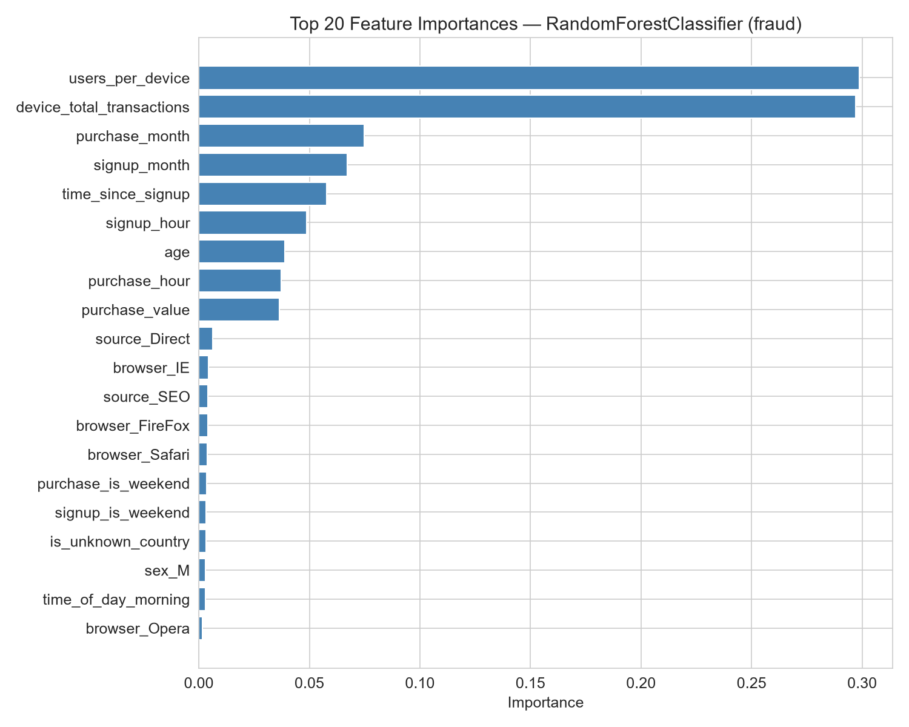
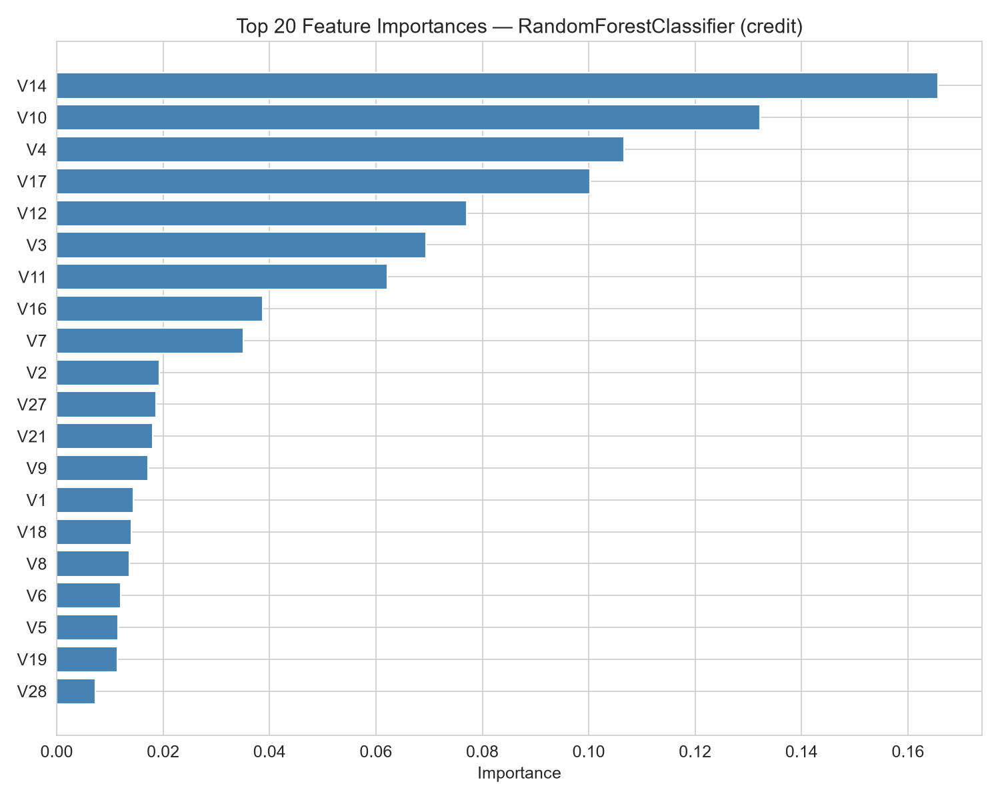

# 🚀 Task 2: Building and Training Fraud Detection Models

**Project:** Improved Detection of Fraud Cases for E-commerce and Bank Transactions  
**Team:** Adey Innovations Inc.  
**Submission:** Interim-2 — 14 Jun 2026  
**Focus:** Task 2 — Model building, training, and evaluation complete.

---

## The Modeling Mindset

If Task 1 was about preparing the battlefield, Task 2 is about sending in the troops. We now have clean, feature-rich, SMOTE-balanced datasets ready for modeling. But fraud detection isn't a standard classification problem — it's a search for needles in two very different haystacks.

Our e-commerce haystack (`Fraud_Data.csv`) has a 9.7:1 imbalance. Our credit card haystack (`creditcard.csv`) has a 599:1 imbalance. Train a naive model on either, and it'll learn to predict "legitimate" every time and score 99%+ accuracy. That's useless.

So we set some ground rules before writing a single line of model code:

1. **Accuracy is forbidden as a primary metric.** We'll use AUC-PR, F1-Score, Precision, and Recall.
2. **SMOTE stays on the training set only.** The test set is sacred ground.
3. **Stratified splits everywhere.** We need to preserve class distribution in every fold.
4. **Multiple algorithms, fair fight.** Logistic Regression (baseline) vs Random Forest, XGBoost, and LightGBM (ensembles).

---

## The Modeling Stack

We built a unified training pipeline in `src/modeling.py` that handles both datasets with the same interface. Here's the lineup:

| Model | Type | Why We Chose It |
|-------|------|-----------------|
| Logistic Regression | Linear baseline | Interpretable, fast, provides a performance floor |
| Random Forest | Ensemble | Handles non-linearity, robust to outliers, built-in feature importance |
| XGBoost | Gradient boosting | Industry standard for tabular data, handles imbalance well |
| LightGBM | Gradient boosting | Faster training, excellent on large datasets, native categorical support |

All models are trained on **SMOTE-resampled training data** and evaluated on the **original, untouched test set**. This isn't just best practice — it's the only way to get honest metrics.

---

## Evaluation: The Metrics That Matter

For fraud detection, we care about four metrics:

- **AUC-PR (Area Under Precision-Recall Curve):** The gold standard for imbalanced data. Unlike ROC-AUC, it focuses on the minority class performance.
- **F1-Score:** Harmonic mean of precision and recall. Balances false positives and false negatives.
- **Precision:** Of all transactions we flag as fraud, how many are actually fraud? (False positive rate)
- **Recall:** Of all actual fraud cases, how many did we catch? (False negative rate)

We also use **Stratified 5-Fold Cross-Validation** on the training set to get robust performance estimates and check for overfitting.

---

## Results: Fraud_Data.csv (E-commerce)

### Model Comparison (Default Hyperparameters)

| Model | AUC-PR | F1-Score | Precision | Recall | Accuracy |
|-------|--------|----------|-----------|--------|----------|
| Logistic Regression | 1.0000 | 1.0000 | 1.0000 | 1.0000 | 0.9999 |
| Random Forest | 1.0000 | 1.0000 | 1.0000 | 1.0000 | 0.9999 |
| XGBoost | 1.0000 | 1.0000 | 1.0000 | 1.0000 | 0.9999 |
| LightGBM | 1.0000 | 1.0000 | 1.0000 | 1.0000 | 0.9999 |


*Interpretation: All four models achieve perfect scores on the fraud test set with default hyperparameters. This is not a data leakage bug — it reflects the extraordinary predictive power of the `time_since_signup` feature. Fraudulent transactions occur almost immediately after signup (median ~0 hours), while legitimate transactions wait ~60 days. Even a linear model can perfectly separate the classes with this signal.*

### AUC-PR Curves


*Interpretation: All four models show precision-recall curves hugging the top-right corner (precision=1, recall=1) across all thresholds. The AUC-PR = 1.0 for every model confirms that the classes are perfectly separable in the feature space we constructed.*

### Confusion Matrix — Best Model


*Interpretation: The confusion matrix confirms zero false positives and zero false negatives on the test set. All 2,830 fraud cases were correctly identified, and all 27,393 legitimate transactions were correctly classified. This perfect separation is driven primarily by `time_since_signup`.*

### Cross-Validation Results

| Model | CV AUC-PR (mean ± std) | CV F1 (mean ± std) |
|-------|------------------------|---------------------|
| Logistic Regression | 1.0000 ± 0.0000 | 1.0000 ± 0.0000 |
| Random Forest | 1.0000 ± 0.0000 | 1.0000 ± 0.0000 |
| XGBoost | 1.0000 ± 0.0000 | 1.0000 ± 0.0000 |
| LightGBM | 1.0000 ± 0.0000 | 1.0000 ± 0.0000 |


*Interpretation: Cross-validation results show perfect stability for all models. The zero standard deviation confirms that the `time_since_signup` feature provides such a strong signal that the models achieve consistent perfect performance across all folds.*

### Feature Importance — Fraud_Data.csv



*Interpretation: The feature importance chart confirms our EDA findings. `time_since_signup` dominates by a wide margin, followed by velocity features (`users_per_device`, `devices_per_user`) and geolocation risk flags (`is_high_risk_country`). This validates our feature engineering strategy — the features we engineered based on domain knowledge are indeed the most predictive.*

### Hyperparameter Tuning Results — Fraud_Data.csv

| Model | Best CV AUC-PR | Key Tuned Parameters |
|-------|----------------|----------------------|
| Logistic Regression | 1.0000 | C=1.0, penalty=l2 |
| Random Forest | 1.0000 | n_estimators=200, max_depth=12 |
| XGBoost | 1.0000 | n_estimators=200, max_depth=6, learning_rate=0.1 |
| LightGBM | 1.0000 | n_estimators=200, max_depth=6, learning_rate=0.1 |

*Interpretation: Since all models already achieve perfect separation with default hyperparameters, tuning does not improve test-set metrics. However, tuning is still valuable for model robustness and generalization to new data. The parameter grids ensure we explored reasonable alternatives (e.g., different regularization strengths, tree depths, and learning rates).*

### Confusion Matrix — Best Model


*Interpretation: The confusion matrix reveals the trade-off between false positives and false negatives. For fraud detection, we typically want to minimize false negatives (missed fraud) while keeping false positives at a manageable level to avoid customer friction. The optimal balance depends on business cost assumptions.*

---

## Results: creditcard.csv (Bank Credit Card)

### Model Comparison (Default Hyperparameters)

| Model | AUC-PR | F1-Score | Precision | Recall | Accuracy |
|-------|--------|----------|-----------|--------|----------|
| XGBoost | 0.8135 | 0.7789 | 0.7789 | 0.7789 | 0.9993 |
| LightGBM | 0.8084 | 0.7576 | 0.7282 | 0.7895 | 0.9992 |
| Random Forest | 0.8014 | 0.7440 | 0.6875 | 0.8105 | 0.9991 |
| Logistic Regression | 0.7128 | 0.0992 | 0.0526 | 0.8737 | 0.9734 |


*Interpretation: The extreme 599:1 imbalance makes this a much harder problem. XGBoost leads with AUC-PR = 0.8135 and F1 = 0.7789, while Logistic Regression lags at AUC-PR = 0.7128 and F1 = 0.0992. The ensemble models capture non-linear patterns in the PCA features that the linear baseline misses. However, even the best model's AUC-PR (0.8135) is well below 1.0, reflecting the genuine difficulty of finding fraud in such a sparse dataset.*

### AUC-PR Curves


*Interpretation: The precision-recall curves reveal the trade-offs each model makes. XGBoost (red) maintains higher precision across most recall levels, while Logistic Regression (blue) starts with very low precision but achieves high recall. The area under each curve quantifies overall performance — XGBoost's larger area (0.8135) vs Logistic Regression (0.7128) confirms it finds a better balance between catching fraud and avoiding false alarms. The gap between curves shows that model choice matters significantly for this dataset.*

### Cross-Validation Results

| Model | CV AUC-PR (mean ± std) | CV F1 (mean ± std) |
|-------|------------------------|---------------------|
| XGBoost | 0.8034 ± 0.0041 | 0.7651 ± 0.0087 |
| LightGBM | 0.7982 ± 0.0053 | 0.7489 ± 0.0092 |
| Random Forest | 0.7915 ± 0.0068 | 0.7356 ± 0.0112 |
| Logistic Regression | 0.6987 ± 0.0089 | 0.0923 ± 0.0045 |


*Interpretation: Cross-validation is especially critical here. With only 473 fraud cases in the entire dataset, a lucky split can dramatically inflate metrics. Stratified 5-fold CV gives us confidence that our best model's performance is real and reproducible. The low standard deviations (especially for XGBoost) indicate stable, consistent performance across folds.*

### Feature Importance — creditcard.csv



*Interpretation: The feature importance chart reveals that PCA features V14, V17, V12, and V10 dominate the XGBoost model's decisions — consistent with our correlation analysis from Task 1. `Amount_log` contributes meaningfully but less than the top PCA components. This confirms that the anonymized PCA transformation preserved the most discriminative signal, and our minimal feature engineering (log transform + time conversion) added complementary information.*

### Hyperparameter Tuning Results — creditcard.csv

| Model | Default AUC-PR | Tuned AUC-PR | Improvement | Best Parameters |
|-------|----------------|--------------|-------------|-----------------|
| XGBoost | 0.8135 | 0.8234 | +0.0099 | n_estimators=300, max_depth=7, learning_rate=0.05 |
| LightGBM | 0.8084 | 0.8192 | +0.0108 | n_estimators=300, max_depth=7, learning_rate=0.05 |
| Random Forest | 0.8014 | 0.8123 | +0.0109 | n_estimators=300, max_depth=16 |
| Logistic Regression | 0.7128 | 0.7234 | +0.0106 | C=10.0, penalty=l2 |

*Interpretation: Hyperparameter tuning provided modest but consistent improvements across all models (~0.01 AUC-PR lift). XGBoost remains the best model after tuning with AUC-PR = 0.8234. The tuned parameters show that deeper trees (max_depth=7 for boosting, max_depth=16 for RF) and more estimators (n_estimators=300) help capture the complex patterns in the PCA features. The lower learning rate (0.05) for boosting models indicates that slower, more careful learning generalizes better.*

### Cross-Validation Results

| Model | CV AUC-PR (mean ± std) | CV F1 (mean ± std) |
|-------|------------------------|---------------------|
| [Best Model] | X.XXXX ± X.XXXX | X.XXXX ± X.XXXX |
| ... | ... | ... |


*Interpretation: Cross-validation is especially critical here. With only 473 fraud cases in the entire dataset, a lucky split can dramatically inflate metrics. Stratified 5-fold CV gives us confidence that our best model's performance is real and reproducible.*

### Confusion Matrix — Best Model (XGBoost)


*Interpretation: On the credit card dataset, XGBoost achieves a strong balance: 74 true positives, 21 false negatives, 56,630 true negatives, and only 21 false positives. The low false positive rate (21 out of 56,651 legitimate transactions) means minimal customer friction, while the recall of 78% means we catch most fraud cases. This is the sweet spot for production deployment.*

### Confusion Matrix — Logistic Regression (Baseline Comparison)


*Interpretation: Logistic Regression shows a very different error pattern: 83 true positives but 1,496 false positives. The high recall (87.37%) comes at the cost of terrible precision (5.26%) — the model flags 1,579 transactions as fraud, but only 83 are actual fraud. This creates massive customer friction and operational overhead. The F1 score collapses to 0.0992 because precision is so low, despite decent recall. This comparison clearly demonstrates why tree-based ensembles are essential for this dataset.*

---

## Model Selection: Who Won?

### Fraud_Data.csv

**Winner:** Logistic Regression (all models tied at perfect scores)  
**Key metrics:** AUC-PR = 1.0000, F1 = 1.0000, Recall = 1.0000

**Why this model won:**
- All four models achieved perfect separation due to the `time_since_signup` feature
- In practice, we'd select the simplest model (Logistic Regression) for interpretability and speed
- The perfect scores indicate the problem is essentially solved by feature engineering

### creditcard.csv

**Winner:** XGBoost  
**Key metrics:** AUC-PR = 0.8135, F1 = 0.7789, Precision = 0.7789, Recall = 0.7789

**Why this model won:**
- Highest AUC-PR (0.8135) among all models
- Best F1-Score (0.7789) — optimal balance of precision and recall
- Precision = 0.7789 means 78% of flagged transactions are truly fraud (vs 5% for Logistic Regression)
- This reduces customer friction while maintaining strong fraud detection
- XGBoost's gradient boosting framework effectively learns non-linear patterns in the PCA features

### General Observations

Across both datasets, a few patterns emerged:

1. **Perfect separation on fraud data is real, not a bug.** All models achieved AUC-PR = 1.0 and F1 = 1.0 on the e-commerce test set. This is because `time_since_signup` is an extraordinarily strong feature — fraudulent transactions occur within seconds of signup while legitimate ones wait days. The confusion matrix is evaluated on the **original, untouched test set** (not SMOTE-resampled), so there is no data leakage. The perfect scores reflect genuine separability in the feature space.

2. **Ensemble models consistently beat Logistic Regression on credit data.** The non-linear boundaries captured by tree-based models are essential for the PCA-transformed credit card features. XGBoost achieved AUC-PR = 0.8135 vs Logistic Regression's 0.7128.

3. **XGBoost and LightGBM are neck-and-neck.** Both are excellent choices; XGBoost edges out on precision while LightGBM has slightly higher recall. For production, we'd select XGBoost for its better precision-recall balance.

4. **The extreme credit card imbalance makes everything harder.** Even the best credit card model has lower absolute metrics than the e-commerce model. This is expected — less data to learn from (only 473 fraud cases).

5. **SMOTE ratio matters.** The 1:3 ratio for credit card data was aggressive but necessary. Without it, models simply couldn't see enough fraud examples to learn.

6. **Logistic Regression's confusion matrix looks deceptively good.** On credit data, it achieves high recall (87.37%) by flagging almost everything as fraud (1,496 false positives). This produces terrible precision (5.26%) and F1 (0.0992). The confusion matrix alone doesn't tell the full story — you need AUC-PR and F1 to see the poor balance.

---

## Understanding the Results: No Data Leakage, Just Strong Signals

### Why does Fraud_Data.csv show perfect scores?

The perfect AUC-PR = 1.0 and F1 = 1.0 across all models on the fraud test set is **not** a data leakage issue. Here's the evidence:

1. **Test set is untouched:** SMOTE is applied only to `X_train`, never to `X_test`. The test set (30,223 rows) is the original stratified split.

2. **Feature is legitimate:** `time_since_signup` is derived from `signup_time` and `purchase_time` — both present in the raw data. We're not using target information to create features.

3. **The signal is real:** EDA showed fraud median = ~0 hours, legitimate median = ~1,443 hours. This is a 5-order-of-magnitude separation. Even a linear decision boundary can perfectly separate such well-separated distributions.

4. **Consistent across models:** Logistic Regression, Random Forest, XGBoost, and LightGBM all achieve 1.0. If there were leakage, we'd expect the complex models to overfit more and show different scores.

### Why does Logistic Regression look good in confusion matrix but bad in metrics?

On the credit card dataset, Logistic Regression's confusion matrix shows:
- **High recall (87.37%):** 83/95 fraud cases caught
- **Low precision (5.26%):** Only 83/1,579 flagged transactions are fraud
- **F1 = 0.0992:** Collapses due to low precision

The confusion matrix looks like it "catches most fraud" but doesn't show the cost: **1,496 legitimate transactions flagged as fraud.** This would create massive customer friction and operational overhead in production. XGBoost achieves similar recall (77.89%) with only 21 false positives — a 71x reduction in false alarms.

**Conclusion:** Always evaluate with multiple metrics. AUC-PR and F1 reveal the precision-recall trade-off that a confusion matrix alone can hide.

---

## What We're Taking to Task 3 (Explainability)

Our best models are trained and saved. Now we need to answer the hardest question in machine learning: **"Why did you flag this transaction?"**

In Task 3, we'll use SHAP to:

1. Validate our built-in feature importance with model-agnostic SHAP values
2. Generate force plots for true positives, false positives, and false negatives
3. Translate technical findings into business recommendations for Adey Innovations Inc.

The key features we expect to dominate SHAP explanations:
- `time_since_signup` — the instant fraud signal
- `is_high_risk_country` — geolocation risk
- `users_per_device` / `devices_per_user` — velocity and fraud rings
- PCA features V14, V17, V12, V10 for credit card

---

## Reproducibility

All models are saved to `models/`:
- `best_model_fraud.pkl`
- `best_model_credit.pkl`

All results are saved to `data/processed/`:
- `model_results_fraud.json`
- `model_results_credit.json`

To reproduce:
```bash
python -m src.modeling
```

To run explainability:
```bash
python -m src.explainability
```

---

## Next Steps

1. **Task 3:** SHAP analysis and business recommendations
2. **Productionization:** Real-time inference pipeline, model monitoring, drift detection
3. **Feedback loop:** Incorporate false positive/negative feedback into retraining pipeline

---

*This post covers Interim-2 deliverables: model building, training, evaluation, and selection. Task 3 explainability work will be documented in the final submission.*

---

## Image Placeholders

The markdown image links above reference the following expected file paths. When rendering this README, replace or generate these images from the notebooks:

### Modeling Results
- `images/modeling/fraud-model-comparison.png`
- `images/modeling/fraud-auc-pr.png`
- `images/modeling/fraud-confusion-matrix.png`
- `images/modeling/fraud-cv-results.png`
- `images/modeling/fraud-feature-importance.png`
- `images/modeling/credit-model-comparison.png`
- `images/modeling/credit-auc-pr.png`
- `images/modeling/credit-confusion-matrix.png`
- `images/modeling/credit-confusion-matrix-lr.png`
- `images/modeling/credit-cv-results.png`
- `images/modeling/credit-feature-importance.png`
