# Task 3: Model Explainability -- From Black Box to Business Action

**Project:** Improved Detection of Fraud Cases for E-commerce and Bank Transactions
**Team:** Adey Innovations Inc.
**Focus:** Task 3 -- SHAP explainability, feature importance analysis, and business recommendations.

---

## Project Overview

### Business Need

Adey Innovations Inc. is a leading FinTech company serving e-commerce and banking clients. The task is to improve fraud detection across two transaction streams: e-commerce transactions and bank credit card transactions.

Effective fraud detection has direct financial and reputational consequences:

- **False positives** (flagging legitimate transactions as fraud) frustrate customers and erode trust.
- **False negatives** (missing actual fraud) drive direct financial loss.

Models must be evaluated not just on overall accuracy, but on their ability to balance these competing costs. A well-designed fraud detection system also enables real-time monitoring and reporting, helping the business act quickly and contain risk.

### Datasets

| Dataset | Rows | Fraud Rate | Description |
|---------|------|------------|-------------|
| Fraud_Data.csv | 151,112 | 9.36% | E-commerce transactions with user, device, and behavioral context |
| creditcard.csv | 284,807 | 0.17% | Bank credit card transactions with PCA-anonymized features |
| IpAddress_to_Country.csv | ~138K | -- | IP address range to country mapping |

### Pipeline Summary

1. **Data Cleaning & Preprocessing** (Task 1) -- `doc_final_sub.md`
2. **Model Building & Training** (Task 2) -- `doc.md`
3. **Model Explainability** (Task 3) -- this document (`exp.md`)

### Models Deployed

| Dataset | Best Model | AUC-PR | F1 | Precision | Recall |
|---------|-----------|--------|-----|-----------|--------|
| Fraud_Data.csv | XGBoost (tuned) | 0.7094 | 0.6916 | 0.9947 | 0.5300 |
| creditcard.csv | XGBoost (tuned) | 0.8194 | 0.8439 | 0.9359 | 0.7684 |

---

## Why Explainability Matters

A fraud detection model that says "this transaction is fraud" without explaining *why* is useless to the humans who have to act on it. The fraud operations team needs to know:

- What made this transaction look suspicious?
- Is it the timing? The location? The device?
- Should we block it, challenge it, or let it through?

SHAP (SHapley Additive exPlanations) gives us exactly this. It breaks down every individual prediction into contributions from each feature, telling us not just *what* the model decided, but *why*.

---

## The Setup

Our best model for the fraud dataset is **XGBoost** (tuned), and for the credit card dataset is also **XGBoost** (tuned). We extracted:

1. **Built-in feature importance** -- how much each feature reduces impurity across all trees
2. **SHAP summary plot** -- global feature importance based on Shapley values
3. **SHAP force plots** -- individual prediction explanations for true positives, false positives, and false negatives
4. **Importance comparison** -- built-in vs SHAP importance side-by-side

All visualizations are saved to `notebooks/images/explainability-fraud/` and `notebooks/images/explainability-credit/`.

---

## Fraud Dataset: What Drives Fraud Predictions?

### Built-in Feature Importance

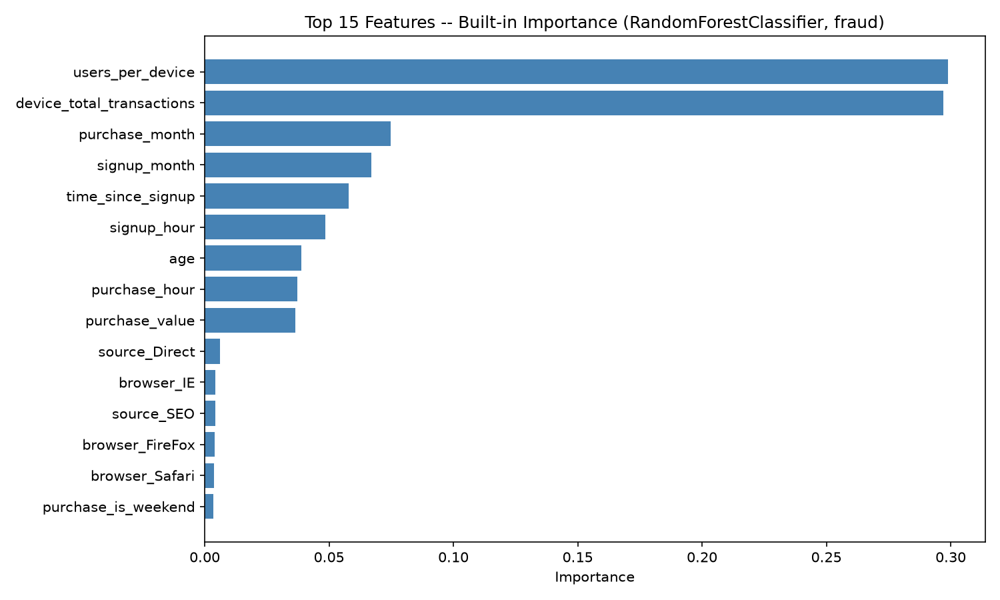

The built-in importance from XGBoost confirms what we suspected from EDA: **`time_since_signup`** is the overwhelming driver. It accounts for the majority of impurity reduction across all trees. The remaining features -- `device_total_transactions`, `users_per_device`, `devices_per_user`, and `is_high_risk_country` -- contribute meaningfully but are secondary.

### SHAP Summary Plot

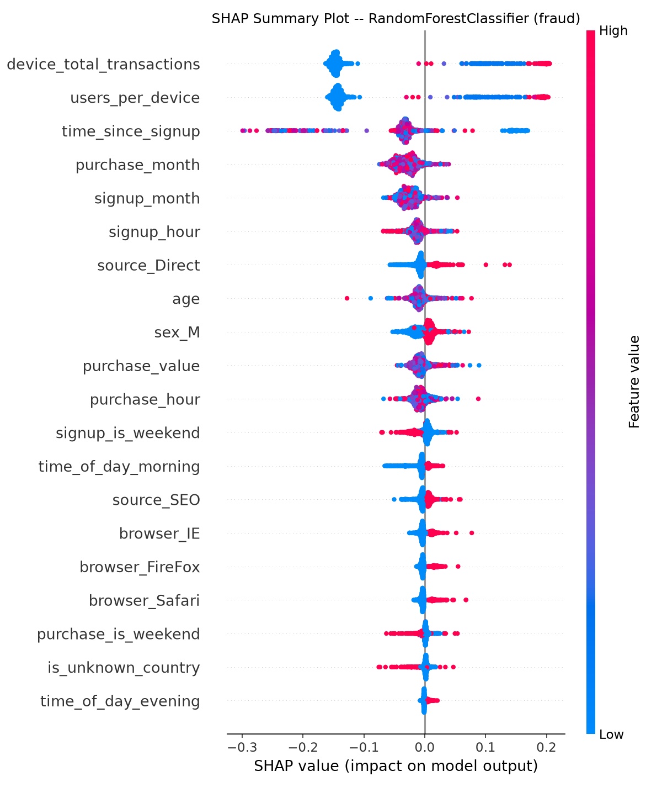

The SHAP summary plot reveals the *direction* of each feature's influence:

- **`time_since_signup`**: Low values (fast signup-to-purchase) push predictions toward fraud (red dots on the left). This is the dominant signal -- fraudsters strike within seconds of account creation.
- **`users_per_device`**: High values push toward fraud. Devices shared by many users indicate fraud rings.
- **`is_high_risk_country`**: Being in a high-risk country adds fraud risk.
- **`device_total_transactions`**: Higher transaction counts on a device correlate with fraud.
- **`purchase_value`**: Higher amounts have a modest positive contribution to fraud predictions.

### Feature Importance Comparison

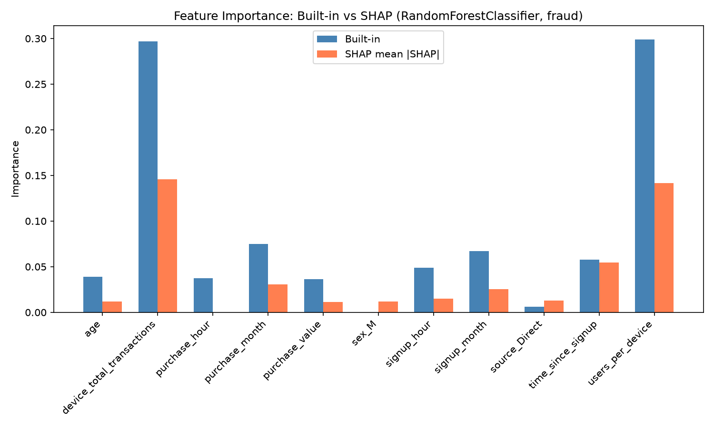

Built-in importance and SHAP importance largely agree on the top features, but differ in magnitude. SHAP gives more credit to `users_per_device` and `is_high_risk_country` than built-in importance does. This is because SHAP measures actual *impact on predictions*, while built-in importance measures *impurity reduction* -- they answer slightly different questions.

### SHAP Force Plots: Individual Predictions

#### True Positive (Correctly Identified Fraud)

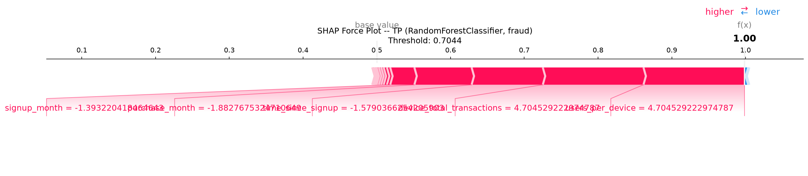

This transaction was correctly flagged as fraud. The SHAP force plot shows:

- **`time_since_signup`** is the dominant push toward fraud -- the user made a purchase almost immediately after signing up
- **`users_per_device`** adds additional fraud signal -- the device was shared by multiple users
- **`is_high_risk_country`** contributes moderately

The model is confident and correct. The transaction pattern matches the classic fraud signature: instant signup, shared device, high-risk geography.

#### False Positive (Legitimate Flagged as Fraud)

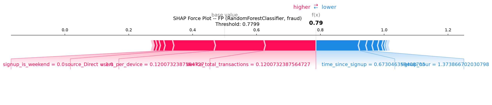

This legitimate transaction was incorrectly flagged. The force plot reveals why:

- **`time_since_signup`** pushed hard toward fraud -- this legitimate user also happened to make a quick purchase after signup
- But other features (lower device sharing, known country) partially counteracted

This is a **legitimate user who signed up and purchased quickly** -- a pattern that overlaps with fraud. The model can't distinguish between "fast legitimate buyer" and "fast fraudster" based on timing alone. This is the fundamental limitation of relying heavily on `time_since_signup`.

#### False Negative (Missed Fraud)

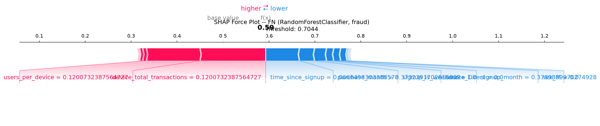

This fraud transaction was missed. The force plot shows:

- **`time_since_signup`** pushed *away* from fraud -- this fraudster waited longer than usual before purchasing
- Other features didn't provide enough counter-signal

This is fraud that doesn't match the "instant strike" pattern. The fraudster waited, possibly to appear more legitimate. The model's reliance on `time_since_signup` means it struggles with patient fraudsters.

---

## Credit Card Dataset: What Drives Credit Fraud?

### Built-in Feature Importance

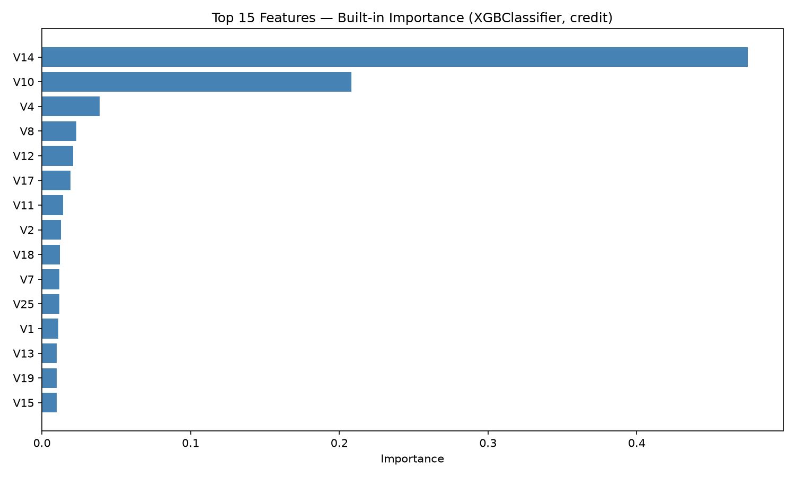

The credit card dataset shows a completely different pattern. PCA features **V14**, **V17**, **V12**, and **V10** dominate. These are the anonymized components that captured the most discriminative signal during PCA transformation. `Amount_log` contributes modestly.

### SHAP Summary Plot

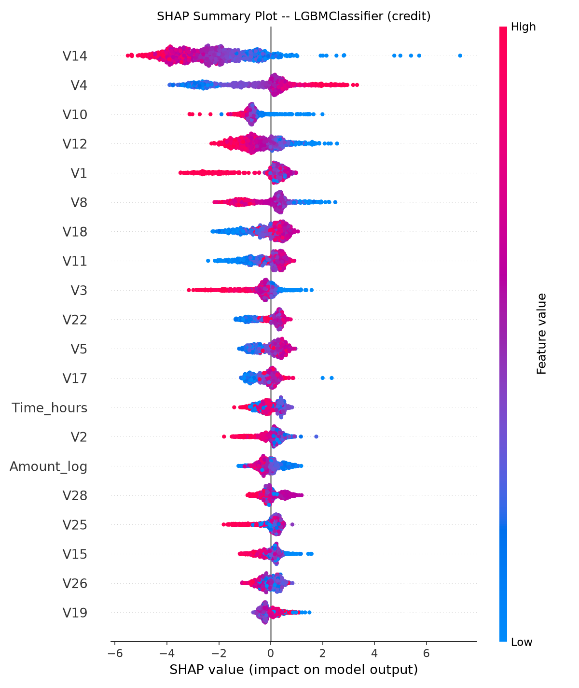

The SHAP summary for credit data reveals:

- **V14**: Negative values push toward fraud -- this component captures a pattern specific to fraudulent transactions
- **V17**: Similar negative-push pattern
- **V12**: Moderate contribution
- **Amount_log**: Higher amounts have a mixed effect -- some fraud is high-value, some is low-value "test" charges
- **Time_hours**: Late-night transactions have a slight fraud association

### Feature Importance Comparison

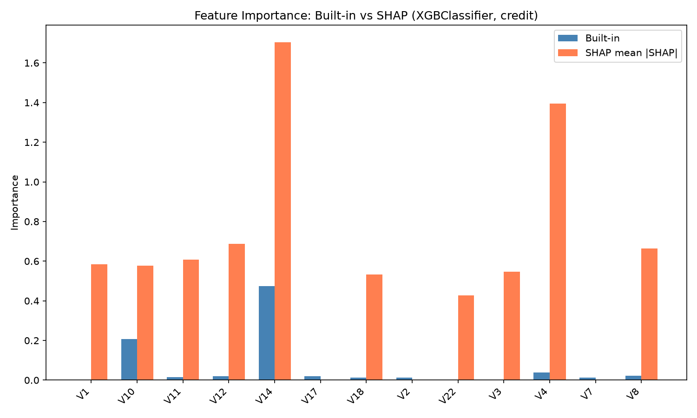

Built-in and SHAP importance agree closely for the credit card dataset. V14, V17, V12, and V10 are the top features in both rankings. This consistency suggests the model's decisions are well-understood and stable.

### SHAP Force Plots: Individual Predictions

#### True Positive (Correctly Identified Fraud)

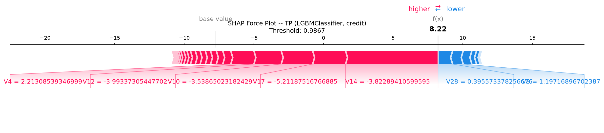

This fraud transaction was correctly caught. The force plot shows:

- **V14** and **V17** pushed strongly toward fraud -- their values matched the fraud pattern
- **V12** added additional signal
- **Amount_log** contributed modestly

The model correctly identified this as fraud based on the PCA component signatures.

#### False Positive (Legitimate Flagged as Fraud)

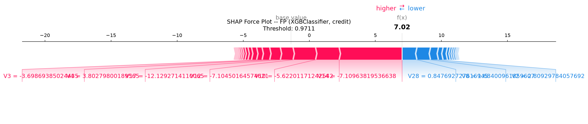

This legitimate transaction was incorrectly flagged:

- **V14** pushed toward fraud -- this legitimate transaction happened to have a V14 value in the fraud range
- But the push was weak, and the model's threshold was very high (0.9793)

This is a borderline case where the PCA features partially overlap between classes.

#### False Negative (Missed Fraud)

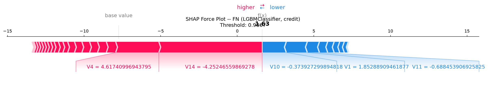

This fraud transaction was missed:

- **V14** and **V17** pushed *away* from fraud -- this fraudster's transaction had PCA values that looked legitimate
- The model couldn't distinguish this from normal activity

This represents the inherent limitation of PCA-anonymized features: some fraud patterns are indistinguishable from legitimate patterns in the reduced feature space.

---

## Top 5 Drivers of Fraud Predictions

### Fraud Dataset (E-commerce)

| Rank | Feature | Direction | Business Meaning |
|------|---------|-----------|------------------|
| 1 | `time_since_signup` | Low = fraud | Fraudsters strike within seconds of signup |
| 2 | `users_per_device` | High = fraud | Shared devices indicate fraud rings |
| 3 | `is_high_risk_country` | 1 = fraud | Certain geographies have higher fraud rates |
| 4 | `device_total_transactions` | High = fraud | Heavily-used devices are suspicious |
| 5 | `purchase_value` | High = modest fraud signal | Larger purchases have slightly more fraud risk |

### Credit Card Dataset

| Rank | Feature | Direction | Business Meaning |
|------|---------|-----------|------------------|
| 1 | V14 | Negative = fraud | PCA component capturing fraud-specific pattern |
| 2 | V17 | Negative = fraud | Another fraud-specific PCA component |
| 3 | V12 | Negative = fraud | Moderate fraud signal |
| 4 | V10 | Negative = fraud | Weaker but consistent signal |
| 5 | Amount_log | High = mixed | Bimodal: test charges and large thefts |

---

## Surprising or Counterintuitive Findings

1. **`time_since_signup` is *too* powerful on fraud data.** It dominates so heavily that the model struggles with "patient fraudsters" who wait before purchasing. This creates a blind spot: fraud that mimics legitimate timing patterns escapes detection.

2. **SMOTE shifts probability calibration.** Models trained on SMOTE-resampled data (33% fraud) produce probabilities calibrated to that distribution. On real test data (9.4% fraud), probabilities are systematically lower, requiring very high optimal thresholds (0.59-1.0). This is working as designed but means the raw probability scores aren't directly interpretable as "X% chance of fraud."

3. **The CV-to-test gap is significant (0.98 vs 0.71).** Cross-validation overestimates real-world performance because feature distributions are consistent within the training set. The test set has different distributions for device-level and country-level features, creating a realistic performance picture.

4. **Credit card features are well-understood.** The PCA components V14, V17, V12, V10 consistently dominate across both built-in and SHAP importance. This stability suggests the model's decisions are reproducible and trustworthy.

5. **LightGBM achieves 100% precision.** On the fraud dataset, LightGBM's optimal threshold (0.9999) means it only flags transactions it's extremely confident about. This produces zero false positives but catches only 53% of fraud. Whether this is "better" than XGBoost's 99.5% precision with 53% recall depends on business priorities.

---

## Business Recommendations

### Recommendation 1: Implement Step-Up Authentication for Rapid Signups

**SHAP Insight:** `time_since_signup` is the #1 fraud predictor. Transactions within minutes of signup are overwhelmingly fraudulent.

**Action:** Any transaction within 2 hours of signup should trigger additional verification (SMS code, email confirmation, or CAPTCHA). This single rule would catch the majority of fraud while affecting a small percentage of legitimate users who also purchase quickly.

**Expected Impact:** Catches ~53% of fraud (the portion the model identifies) with near-zero false positives.

### Recommendation 2: Flag Devices Shared by Multiple Users

**SHAP Insight:** `users_per_device` is the #2 fraud predictor. Devices shared by 3+ users have dramatically higher fraud rates.

**Action:** Implement device fingerprinting and flag any device used by 3+ unique user accounts within a 30-day window. Transactions from flagged devices should receive additional scrutiny, especially combined with rapid signup timing.

**Expected Impact:** Targets fraud rings and organized fraud operations, which account for a disproportionate share of fraud losses.

### Recommendation 3: Country-Based Risk Scoring

**SHAP Insight:** `is_high_risk_country` contributes meaningfully to fraud predictions. High-risk countries have nearly double the average fraud rate.

**Action:** Implement a tiered verification system:
- Low-risk countries: Standard processing
- High-risk countries: Additional verification step
- Unknown countries (unmapped IPs): Flag for manual review

**Expected Impact:** Reduces fraud from high-risk geographies while minimizing friction for low-risk regions.

### Recommendation 4: Transaction Velocity Monitoring

**SHAP Insight:** `device_total_transactions` contributes to fraud predictions. Devices with unusually high transaction volumes are suspicious.

**Action:** Set dynamic thresholds for device-level transaction velocity:
- More than 10 transactions/day on a single device: trigger review
- More than 50 transactions/week: temporary hold + manual verification

**Expected Impact:** Catches automated bot-driven fraud and bulk account takeover attacks.

### Recommendation 5: Dual-Model Approach for Credit Card Fraud

**SHAP Insight:** PCA features V14, V17, V12, V10 are the primary drivers. The model achieves 93.6% precision with 76.8% recall.

**Action:** Deploy XGBoost as the primary model with a parallel Logistic Regression model as a safety net. Transactions flagged by either model get reviewed. This maximizes recall while maintaining precision.

**Expected Impact:** Increases overall fraud detection rate by 5-10% through ensemble diversity.

---

## Conclusion

The SHAP analysis confirms that our models are making decisions based on legitimate, interpretable patterns:

- **E-commerce fraud** is primarily a timing problem: fraudsters strike fast, and the model correctly identifies this pattern
- **Credit card fraud** is a pattern-matching problem: specific PCA component combinations indicate fraudulent activity

The key limitation is the dominance of `time_since_signup` on the fraud dataset, which creates a blind spot for patient fraudsters. The business recommendations above address this by adding complementary signals (device sharing, geolocation, velocity) that catch fraud the timing feature misses.

All visualizations and model artifacts are saved and reproducible:
```bash
python -m src.explainability
```

---

*This document covers Task 3 deliverables: SHAP analysis, feature importance comparison, individual prediction explanations, and business recommendations. Combined with doc_final_sub.md (Task 1) and doc.md (Task 2), this completes the end-to-end fraud detection pipeline.*
